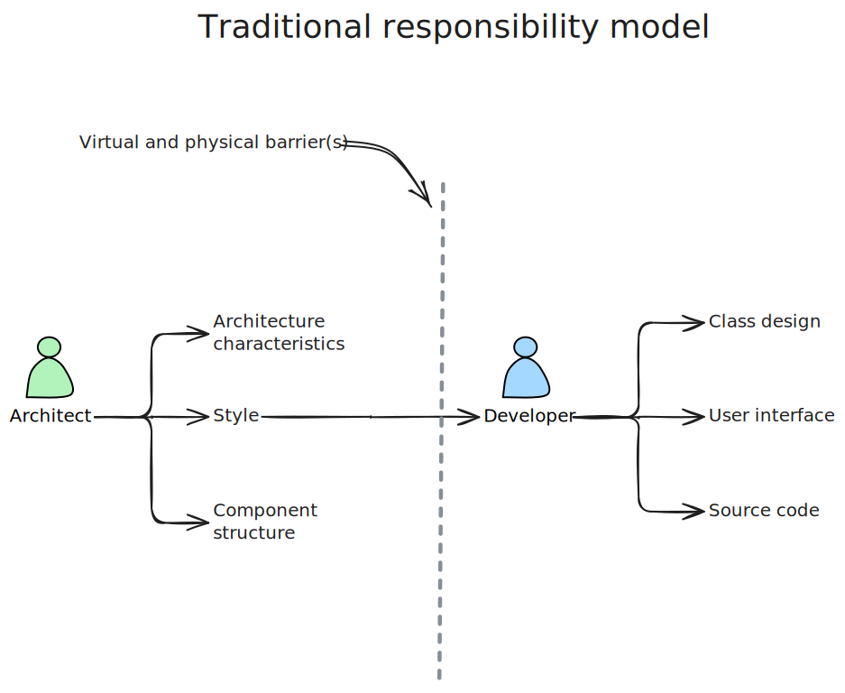
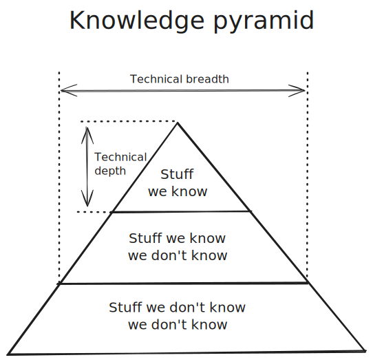
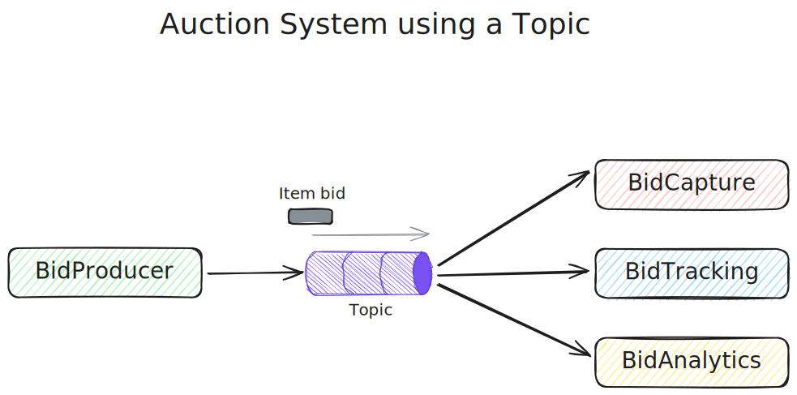
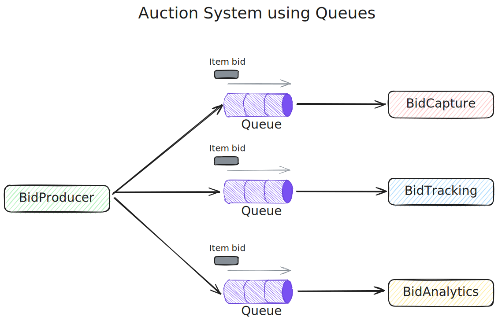

# Architectural Thinking

Architectural thinking is seeing things differently from a developer's perspective. It's not just "thinking about the architecture".

There are four aspects of thinking like an architect:
1. Understanding the difference between architecture and design
2. Having a wide breadth of technical knowledge, while still maintaining a certain level depth
3. Understanding, analyzing, and reconciling trade-offs between solutions and technologies
4. Understanding the importance of business drivers and how they translate to architectural concerns

## Architecture Versus Design

Thinking like an architect is knowing the difference between architecture and design. 

Traditionally, an architect's responsibility included analyzing business requirements and translating them to architectural characteristics, deciding architecture patterns and styles will be used, and creating components (building blocks of the system). These artifacts were then handed off to the development team.

The unidirectional arrow passing through the barrier(s) is what's wrong with the traditional responsibility model because it separates the architect from the developer. Decisions that the architect makes sometimes never make it to the development team, and vice versa - decisions that the development team makes that affect the architecture never make it back to the architect. To make architecture work, we need to break down the barriers. The architect and the developer must be on the same team. This also allows the architect to provide mentoring and coaching to the developers on the team.

So, where does architecture end and design start? It doesn't - they coexist in parallel within the lifecycle of the software project and must be kept in synchronization.

## Technical breadth

A developer focuses on acquiring and maintaining *technical depth*, while an architect focuses on *technical breadth*. It's crucial to have a significant amount of breadth in order to think like an architect.

We can categorize all of the knowledge into three sections: *stuff we know*, *stuff we know we don't know*, *stuff we don't know we don't know*.

A large part of the architect's value is having a *broad* technological understanding and knowing how to use it to solve particular problems. The most important part of the pyramid for an architect are the *top* and *middle* - the further the middle part extends into the bottom one, the wider the technical breadth.

That's why it's wise for an (aspiring) architect to sacrifice some hard-won expertise to gain time to broaden their technological portfolio. Some expertise will remain, most likely the technologies that the architect enjoys working with, while others will *usefully atrophy*.

Transitioning to an architect role from a developer role means a shift in perspective - which many developers find difficult. This causes two common dysfunctions:
1. An architect tries to maintain expertise in wide variety of areas, succeeding in none of them
2. *Stale expertise* - the mistaken sensation that your outdated information is still cutting edge

### Frozen Caveman Anti-Pattern

The Frozen Caveman anti-pattern is a behavioral anti-pattern that describes an architect who always reverts back to their irrational concerns for every architecture. One of Neil's (the author) colleagues worked on a centralized system, but each time they delivered a design they asked "But what if we lose Italy?". Several years before, a communication problem had prevented the HQ to communicate with stores in Italy and caused great inconveniences. Because of that, the architect had become obsessed with this particular architectural characteristic.

This anti-pattern manifests in architects who have been burned in the past by either a bad decision or something unexpected, making them particularly cautious in the future. Assessing the risk is important, but we should also be realistic. We should understand the difference between genuine and perceived technical risk. Thinking like an architect means overcoming these "frozen caveman" ideas, seeing other solutions, and asking more relevant questions.

## Analyzing Trade-offs

Thinking like an architect is seeing trade-offs in every solution, and analyzing them to determine which one is the best.

> *"Architecture is the stuff you can't google" - Mark Richards*

*Everything* in architecture is a trade-off, hence the famous answer to everything - "it depends".

> *"There are no right or wrong answers in architecture - only trade-offs" - Neil Ford*

Let's see an example of an item auction system, where someone places a bid for an item up for auction. The `BidProducer` service generates a bid from the bidder and sends it to the `BidCapture`, `BidTracking`, and `BidAnalytics` services. There are two possible solutions: using *topic* (pub-sub) or *queues* (point-to-point). Which one should the architect use?

Let's analyze the *topic* solution:
- The `BidProducer` service only requires a single connection to a topic
- If a new service gets added, we won't need to change the existing system
- The `BidProducer` is more decoupled - doesn't know how the bid info is used

The topic solution has a clear advantage - *architectural extensibility*.

Now let's compare the *queues* solution with the *topic* solution:
- The `BidProducer` needs a separate connection to each queue
- Adding a new service means creating a new queue and connecting to it
- The `BidProducer` is more coupled - knows how the bid info is used

It seems clear that the topic approach is the obvious and best choice, right? Thinking architecturally is also looking at the negatives of a given solution, or the *trade-offs*. So, let's look at the *topic* solution's trade-offs:
- Anyone can access bidding data (issue with data access and security)
	- In the *queues* solution, the `BidProducer` knows where it sends the data, and can alert when a rogue service tries to "wiretap" into it
- The contracts are homogenous - the `BidProducer` sends out only one shape of data, forcing all subscribing services to accept it
	- In the *queues* solution, each service implements its queue, and the `BidProducer` sends the bidding data separately to each queue. The `BidProducer` can fine-tune the bidding information per service.
- The *topic* model does not support monitoring of the number of messages in the topic, and hence auto-scaling is harder to implement
	- In the *queues* solution, each queue can be monitored individually, so we can apply programmatic load-balancing to scale automatically
	- <u>Disclaimer</u>: this is a technology specific trade-off - some messaging protocols do support programmatic load balancing and monitoring

So, which is the better option? The answer is - "it depends". This table summarizes the trade-offs:

| Topic advantages            | Topic disadvantages                                                  |
| --------------------------- | -------------------------------------------------------------------- |
| Architectural extensibility | Data access and security concerns                                    |
| Service decoupling          | No heterogeneous contracts. Monitoring and programmatic scalability. |

The point is - *everything* has a trade-off. Thinking like an architect is analyzing these trade-offs, then asking "which is more important: extensibility or security?" The decision between different solutions always depends on business drivers, environment, and a host of other factors.

## Understanding Business Drivers

Thinking like an architect is understanding business drivers, and translating them into *architecture characteristics*. This requires the architect to have a certain level of understanding of the business domain and to have a healthy, collaborative relationship with the business stakeholders.

## Balancing Architecture and Hands-On Coding

Every architect should code and be able to maintain a certain level of technical depth.

The first tip is to avoid the bottleneck trap - when the architect takes ownership of critical code and becomes a bottleneck to the team. This happens because the architect is not a full-time developer and can't produce code with the same frequency as developers can. To avoid the bottleneck trap, the architect should delegate critical code to others, and focus on coding business functionalities that are one to three iterations down the road.

Another tip is to do frequent proof-of-concepts. This not only helps the architect write code, but also to test and validate architecture decisions. The architect should also strive to write the best production-quality proof-of-concept code they can, because oftentimes that same proof-of-concept code ends up in the actual source code and becomes a reference architecture or a guiding example that others will follow.

Yet another tip is to tackle technical debt stories or architecture stories. These stories are usually low priority, so if the architect doesn't have time to finish them in the current sprint, it won't impact the success.

The architect can focus on fixing bugs within the sprint. Fixing bugs helps the architect identify where issues and weaknesses lie in the codebase or potentially the architecture.

The architect can also focus on creating simple command-line tools and analyzers for the development team. Look for repetitive tasks the team performs and automate the process.

The last tip is to do frequent code reviews. This allows the architect to ensure compliance with the architecture, and also to seek out mentoring and coaching opportunities within the team.