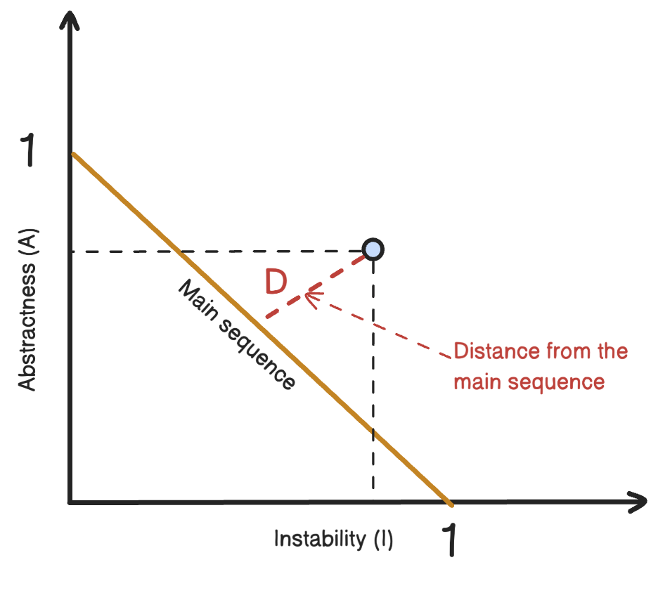

# Modularity

> *"95% of the words about software architecture are spent on extolling the benefits of 'modularity' and that little, if anything, is said about how to achieve it." - Glenford J. Myers (1978)*

Modularity is a way of grouping related code together into _modules_. It is an organizing principle. To explain it using physics, software systems model complex systems, which naturally gravitate towards entropy, or disorder. In order to preserve order in the physical system, energy must be added. Same for software - architects must actively check (measure) the quality of the software and architecture and "do things" in order to maintain good structural soundness, which doesn't happen by accident.

Modularity is not an architectural characteristic. No project will have a requirement to have a good modular distinction, but every project need to maintain order and consistency.

## Definition

A _module_ is defined as "a set of standardized parts or independent units that can be used to construct a more complex structure". We describe a logical grouping of related code as _modularity_, and that can be a group of classes or functions.

You might think, modularity is a developer's thing, why would architects be concerned about it? Because the way developers package things can greatly affect the architecture. For example, reusability is much difficult to achieve (if not impossible) if multiple packages are tightly coupled together.

When we're referring to modularity as grouping of code, we're not referring to physical separation, but a logical one.

## Measuring modularity

There are a few tools (language-agnostic metrics) we can use to measure modularity - _cohesion_, _coupling_, and _connascence_.
### Cohesion

_Cohesion_ refers to how related the parts of the code are to each other. A module is cohesive if all of its parts should be packaged together. If we break them into smaller pieces, it would require coupling the parts together with calls between modules in order to maintain the same functionality.

There are multiple types of cohesion, and here they are listed from best to worst:

_Functional cohesion_
	Every part of the module is related to the other, and the module contains everything essential to function.

_Sequential cohesion_
	The relationship between two modules where one's output is the other's input.

_Communicational cohesion_
	When two modules operate on the same information, or contributes to some output. For example, write something to the database and generate a report based on that information.

_Procedural cohesion_
	When two modules must execute code in a specific order.

_Temporal cohesion_
	When two modules must execute code at a specific time. For example, booting up your computer invokes a number of seemingly unrelate things, but all of them must be initialized when you start your computer.

_Logical cohesion_
	The data within modules is related logically, but not functionally. Example: a module that converts information from text, serialized objects, or streams. The operations are related, but functionally they're very different. A common example is utility packages like `StringUtils` in Java - a group of static methods that operate on `String` but are otherwise unrelated.

_Coincidental cohesion_
	When elements in a module are not related to each other, other than them being in the same source file. This is the most negative form of cohesion.

One thing to note is that _cohesion_ is a less precise metric than _coupling_, and it's often at the discretion of the architect. Let's see an example:
```typescript
class CustomerMaintenance {
  async addCustomer() {/* ... */}
  async updateCustomer() {/* ... */}
  async getCustomer() {/* ... */}
  async notifyCustomer() {/* ... */}
  async getCustomerOrders() {/* ... */}
  async cancelCustomerOrder() {/* ... */}
}
```
Do we leave the last two, or should be isolate them in their own `OrderMaintenance` class? The answer is - _it depends_:
- Are those the only two operations that operate on orders? If yes, then it's fine to leave them in the `CustomerMaintenance` class.
- Is the `CustomerMaintenance` class expected to grow?
- Would the `OrderMaintenance` class require so much knowledge of `Customer` information? If so, separating them in two classes would require a high degree of coupling to make it functional.

These questions represent trade-off analysis. This is at the heart of the job of a software architect.

There's a set of metrics named _"the Chidamber and Kemerer Object-oriented metrics suite"_ that includes many common code metrics. One of them is called _Lack of Cohesion in Methods_ or LCOM for short. This metric measures the structural cohesion of a module, typically a component:

$\text{LCOM96b} = \frac{1}{a} \sum_{j=1}^a \frac{m-μ(Aj)}{m}$

In other words - LCOM is the sum of sets of methods not shared via sharing fields. Here's an illustration of the LCOM metric, where the hexagons represent class fields, and squares represent class methods:


Class X has a low LCOM score, indicating good structural cohesion. Class Y lacks cohesion - each of the field-method pair can actually be refactored into its own class without affecting the other fields or methods. Class Z shows mixed cohesion, where we can refactor the last field/method combination into its own class.

The LCOM metric is useful when moving from one architectural style to another. It can help you find classes that are incidentally coupled.

Have in mind that the LCOM metric does have deficiencies - it can only find structural lack of cohesion, but it cannot determine logically if particular pieces fit together. Remember the Second Law of Software Architecture - _why_ over _how_?
### Coupling

In 1979 Edward Yourdon and Larry Constantine published _Structured Design: Fundamentals of a Discipline of Computer Program and Systems Design_ in which they defined the metrics _afferent_ and _efferent_ coupling.

_Afferent_ coupling measures the number of _incoming_ connections to a code artifact (references that point to its components, classes, functions, fields, methods, and so on).

_Efferent_ coupling measures the number of _outgoing_ connections to other code artifacts.

You can come up with your own mnemonics in order to remember these better. For example, you can think of _a_ in _afferent_ as _accepting_ (incoming) connections. Or, the _e_ in _efferent_ as _exit_ or _export_ (outgoing connections).

### Abstractness, Instability, and Distance from the Main Sequence

Robert Martin created these three metrics that allow a deeper evaluation of the codebase.

#### Abstractness

_Abstractness_ is the ratio of abstract artifacts (abstract classes, interfaces, and so on) to concrete artifacts (implementations). A code base with too many abstractions is challenging to understand how things are wired together. The formula to measure abstractness:

$\text{A} = \frac{\sum{m^a}}{\sum{m^c}}$

Imagine an application that has 5,000 lines of code all in one `main()` method. The formula's numerator is 1, while the denominator is 5,000. The abstractness of that application is almost 0.

#### Instability

_Instability_ is the ratio of _efferent_ coupling to the sum of both _efferent_ and _afferent_ coupling:

$\text{I} = \frac{C^e}{C^e + C^a}$

The _instability_ metric determines the volatility of a codebase. A codebase with high degrees of instability breaks more easily when changed because of _high coupling_. If a class calls to many other classes to delegate work, it's more prone to breakage if one or more of the methods change.

#### Distance from the Main Sequence

This metric is derived from the _Abstractness_ and _Instability_ metrics, and it defines the ideal relationship between abstractness and instability:

$\text{D} = |A + I - 1|$



We can graph the class we're measuring, and then measure its distance from the idealized line. The closer to the line, the better balanced the class is.

The upper-right corner of the graph is called the _Zone of Uselessness_ and that describes code that's too abstract and is difficult to use.

The lower-left corner of the graph is called the _Zone of Pain_ and it describes code with too much implementation and not enough abstraction, which makes it brittle and hard to maintain.


### Connascence

In 1996, Meilir Page-Jones redefined the _afferent_ and _efferent_ metrics for object-oriented programming through a concept he named _connascence_:

> _"Two components are connascent if a change in one would require the other to be modified in order to maintain the overall correctness of the system." - Meilir Page-Jones_

He defined two types of connascence: _static_ and _dynamic_.

#### Static connascence

The static connascence measures coupling on a source code level, in contrast to the dynamic connascence which measures coupling in execution-time. He defined the following types of static connascence:

**Connascence of Name (CoN)**
	Multiple components must agree on the name of an entity.
	Names of variables and methods are the most common way codebases are coupled, and it's also the most recommended because modern day tooling makes system-wide renaming trivial.

```typescript
// Connascence of Name
function printFullName(user) {
  console.log(`${user.firstName} ${user.lastName}`);
}

// The field names must match to what the function expects
const user = {
  firstName: "John",
  lastName: "Doe"
};

printFullName(user);
```

**Connascence of Type (CoT)**
	Multiple components must agree on the type of an entity.
	This refers to limiting variables and parameters to specific types. Bear in mind that this is not a universal language feature. Some dynamically typed languages offer selective typing, like Clojure.

```typescript
function calculateArea(shape) {
  return shape.width * shape.height; // Assumes `shape` has numeric `width` and `height`
}

// Example usage
const rectangle = {
  width: 5, // Must be a number
  height: 10 // Must be a number
};

console.log(calculateArea(rectangle)); // 50
```

**Connascence of Meaning (CoM)** or **Connascence of Convention (CoC)**
	Multiple components must agree on the meaning of particular values.
	The most obvious case is hardcoded numbers rather than constants.

```typescript
function isAdmin(user) {
  return user.role === 1; // Assumes `1` means "admin"
}

const user = {
  name: "Alice",
  role: 1 // Role '1' is not explicitly documented or self-explanatory
};

console.log(isAdmin(user)); // true
```

**Connascence of Position (CoP)**
	Multiple components must agree on the order of values.
	Refers to the ordering of arguments. If there's a function `updateSeat(name: string, seatLocation: string)` and the developer calls it with `updateSeat("30G", "Lazar Nikolov")` the semantics aren't correct, even if the types are.

```typescript
function updateSeat(name, seatLocation) {
  console.log(`${name} has been assigned to seat ${seatLocation}.`);
}

// Correct usage:
updateSeat("Lazar", "30G"); // Output: Alice has been assigned to seat 12A.

// Incorrect usage (order swapped):
updateSeat("30G", "Lazar"); 
// Output: 12A has been assigned to seat Alice. (Incorrect and nonsensical!)
```

**Connascence of Algorithm (CoA)**
	Multiple components must agree on a particular algorithm.
	A common case is encoding and decoding data. Both the encoding and decoding processes must adhere to the same algorithm in order to maintain correctness.

```typescript
// Encoding function
function encodeData(data) {
  return btoa(data.split("").reverse().join("")); // Reverses and encodes to Base64
}

// Decoding function
function decodeData(encodedData) {
  return atob(encodedData).split("").reverse().join(""); // Reverses back and decodes from Base64
}

// Usage
const originalData = "book club";
const encoded = encodeData(originalData); // Encoded: "YnVsYyBrb29i"
const decoded = decodeData(encoded); // Decoded: "book club"

console.log(originalData === decoded); // true
```

#### Dynamic connascence

The other type is the _dynamic connascence_, which analyzes calls at runtime, and there are four types of it:

**Connascence of Execution (CoE)**
	The order of execution of multiple components is important.

```typescript
email = new Email()
email.setRecipient('foo@example.com')
email.setSender('me@me.com')
email.send()
email.setSubject('whoops')
```

**Connascence of Timing (CoT)**
	The timing of the execution of multiple components is important.
	The most common case is a race condition caused by two threads executing at the same time, affecting the outcome of the joint operation.

```typescript
const fs = require("fs");

function processFile() {
  let fileContents;

  // Read the file
  fs.readFile("data.txt", "utf8", (err, data) => {
    if (err) throw err;
    fileContents = data; // Step 1: File content is read
  });

  // Process the file contents
  console.log(fileContents.toUpperCase()); // Step 2: File content processed
}
```

**Connascence of Values (CoV)**
	Occurs when several values relate on one another and must change together.
	Example - a rectangle with 4 points. We can't change one without considering the impact to the other values.

```typescript
// Component 1
const fs = require("fs");

function readConfig() {
  const configPath = "/etc/myapp/config.json"; // Hardcoded file path
  const config = JSON.parse(fs.readFileSync(configPath, "utf8"));
  console.log("Config loaded:", config);
}

readConfig();

// Component 2
const fs = require("fs");

function updateConfig(newConfig) {
  const configPath = "/etc/myapp/config.json"; // Hardcoded file path
  fs.writeFileSync(configPath, JSON.stringify(newConfig, null, 2));
  console.log("Config updated!");
}

updateConfig({ appName: "MyApp", version: "1.0.1" });
```

**Connascence of Identity (CoI)**
	Occurs when multiple components must reference the same entity.

```typescript
// Main application
const user = {
  id: "123", // The unique identifier
  name: "Alice",
  email: "alice@example.com",
};

console.log(`User: ${user.name}, ID: ${user.id}`);

// Analytics service
function logUserEvent(userId, event) {
  console.log(`Logging event for user ${userId}: ${event}`);
}

// Logging an event for the same user
logUserEvent("123", "User logged in");
```

#### Connascence properties

All the connascence types we've seen so far have different properties, like _strength_, _locality_, and _degree_.

_Strength_ defines how easy it is to refactor that type of coupling. Some types of connascence are easier to refactor than others, and that defines their desirability. Architects and developers can improve the coupling characteristics of their codebase by refactoring towards better types of connascence.

Static connascence is preferred over dynamic connascence because it can be determined by simple code analysis, and modern tooling make it easier to improve static connascence. For example, a case of _Connascence of Meaning_ can be improved by refactoring it to _Connascence of Name_ just by creating a named constant rather than using a magic value.


_Locality_ measures how proximal the modules are to each other in the codebase. Promixal code has more and higher forms of connascence than more separated code.

For example, if two classes in the same package have connascence of meaning, it's less damaging to the codebase than if two packages have the same form of connascence.

_Degree_ relates to the size of its impact. Does it impact a few classes or many? The smaller the degree of connascence is, the smaller the damage is.

Page-Jones created three guidelines of using connascence to improve our system's modularity:
1. Minimize overall connascence by breaking the system into encapsulated elements
2. Minimize any remaining connascence that crosses encapsulation boundaries
3. Maximize the connascence within encapsulation boundaries

Jim Weirich repopularized the concept and offers two pieces of advice:
1. Rule of Degree: convert strong forms of connascence into weaker forms of connascence
2. Rule of Locality: as the distance between software elements increases, use weaker forms of connascence

## The problems with 1990s connascence

There are multiple problems with this concept definition. First, these measures look at lower levels of code and focus on quality and hygiene rather than architectural structure. Architects should be concerned of _how_ modules are coupled instead of the _degree_ of coupling. Second, it doesn't really address a fundamental decisions that many modern architects must make, like synchronous or asynchronous communication in distributed architectures like microservices. In Chapter 7 we'll see new ways to think about modern connascence.
